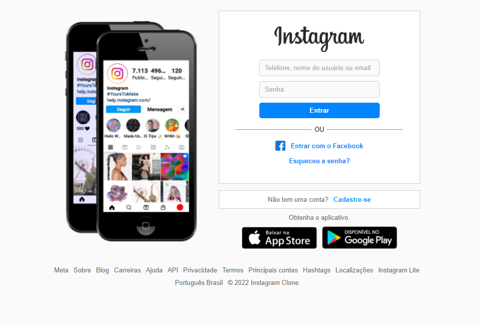

# Site Instagram Clone
## Sobre o projeto

#### Link do Projeto: <a href="https://katarinealbuquerque.github.io/site-instagram-clone/" target=_blank>Abrir Instagram Clone</a>

##### Trabalho desenvolvido para o curso oferecido pela Digital Innovation One, a DIO, para a aula de Flexbox em front-end.

##### O Site Instagram Clone é um trabalho realizado em linguagem de marcação HTML5 para demonstrar as habilidades de como funciona o Flexbox em CSS3, a nova novidade para organizar e facilitar o layout de um site.

## Layout do projeto

## Objetivo do projeto

##### Desenvolver as habilidades de criação de um layout responsivo que se adapte em qualquer tamanho de tela.

## Tecnologias Utilizadas
* ##### HTML 5 
* ##### CSS 3

## Autor

##### Katarine Bezerra de Albuquerque
##### Linkedin: <a href="https://www.linkedin.com/in/katarine-albuquerque/">/katarine-albuquerque</a>
##### GitHub: <a href="https://github.com/KatarineAlbuquerque">/KatarineAlbuquerque</a>

